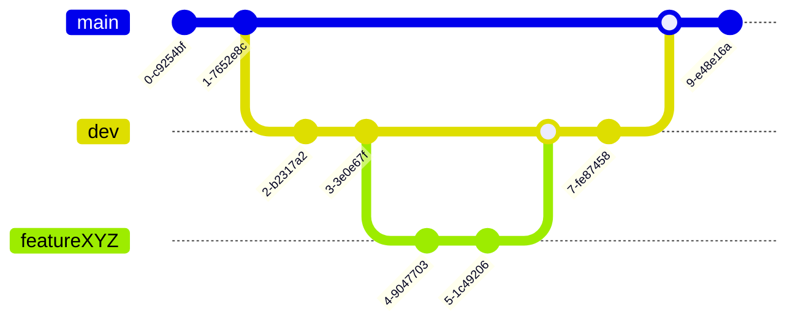

# Git Branching

> [!IMPORTANT]
> New to Git?
>
> Work through the Introduction Sequence at [learngitbranching.js.org](https://learngitbranching.js.org/).
> Or read [W3 Schools Git Tutorial](https://www.w3schools.com/git/git_intro.asp?remote=github).

## Branching Strategy

### Main

The main branch is our most stable branch. This is code that should always be safe to deploy to a robot. 

Code is merged to main once it has been rigorously tested on dev. This makes it competition quality code.

You should never commit directly to the main branch.

### Dev

The developer branch is where features come together to make sure they work well together. Feature branches branch off from dev and are merged back into dev when they are complete.

Bugs on dev should be fixed as soon as possible to ensure that dev remains nearly as stable as main.

### Feature Branches

Feature branches are where the bulk of development happens. Because of this feature branches are never expected to be stable.

When you start work on a new feature, you create a new branch with a descriptive name from the latest version of dev.

Commit changes to the feature branch as you work toward developing the feature.

Bug fixes and other tasks can be treated like features even if they are big flashy subsystems of the robot.

