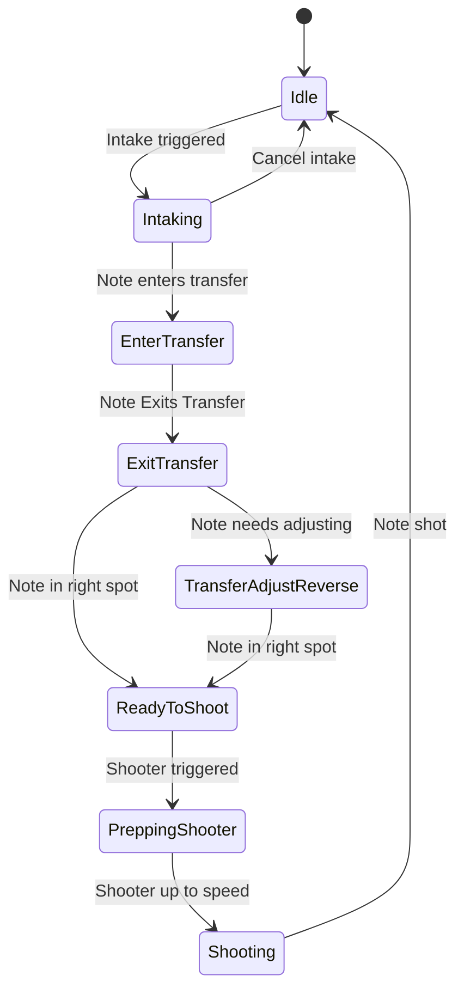

## Note State Machine

A diagram that demonstrates the state machine which describes the possible states and transitions involved in intaking, transferring, and shooting a note. The diagram is written in [mermaid syntax](https://mermaid.js.org/syntax/stateDiagram.html). It will display prettier when viewed in GitHub.

